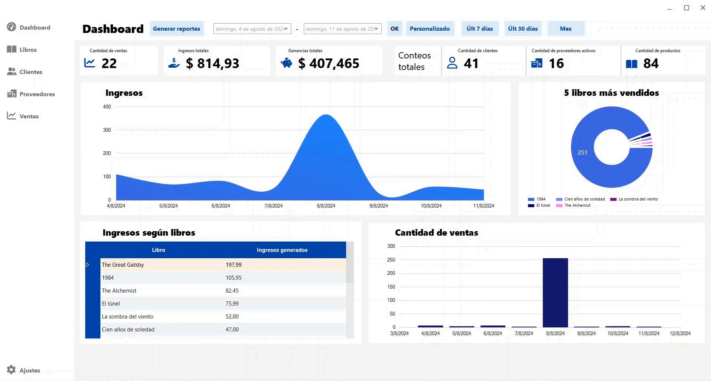

# Librarium

**Librarium** es un sistema integral de gestión de inventario diseñado para librerías. Desarrollado en **Visual Basic .NET** con **Windows Forms**, este proyecto fue creado como Trabajo Final para la cátedra de Teoría de Programación II.

El sistema permite administrar eficientemente libros, clientes, proveedores y ventas, ofreciendo además un dashboard interactivo con estadísticas clave para la toma de decisiones.

---

## Características Principales

*   **Gestión de Inventario**: Alta, baja y modificación de libros.
*   **Administración de Clientes y Proveedores**: Registro detallado de contactos.
*   **Punto de Venta**: Registro de ventas y generación de comprobantes.
*   **Dashboard**: Visualización de métricas como ventas totales, libros más vendidos e ingresos.
*   **Seguridad**: Login de usuarios con contraseñas encriptadas (SHA-256).
*   **Reportes**: Exportación de datos a Excel.

## Tecnologías Utilizadas

*   **Lenguaje**: Visual Basic .NET
*   **Framework**: .NET Framework / .NET 8 (Windows Forms)
*   **Base de Datos**: MySQL
*   **Librerías**:
    *   `MySql.Data` (Conexión a BD)
    *   `ClosedXML` (Excel)
    *   `ReaLTaiizor` (UI Controls)
    *   `HopeCustom` (UI Controls personalizados)
    *   `FontAwesome.Sharp` (Iconos)

## Documentación

*   [Guía de Instalación](docs/installation.md): Pasos detallados para configurar el entorno y ejecutar el proyecto.
*   [Documentación Técnica](docs/technical-docs.md): Detalles sobre la arquitectura, base de datos y clases principales.

## Capturas de Pantalla

## Demo

Puedes ver una demostración completa del funcionamiento del sistema en el siguiente video:
[Ver Demo (MP4)](docs/img/librarium-demo.mp4)

## Licencia

Este proyecto está bajo la Licencia MIT.